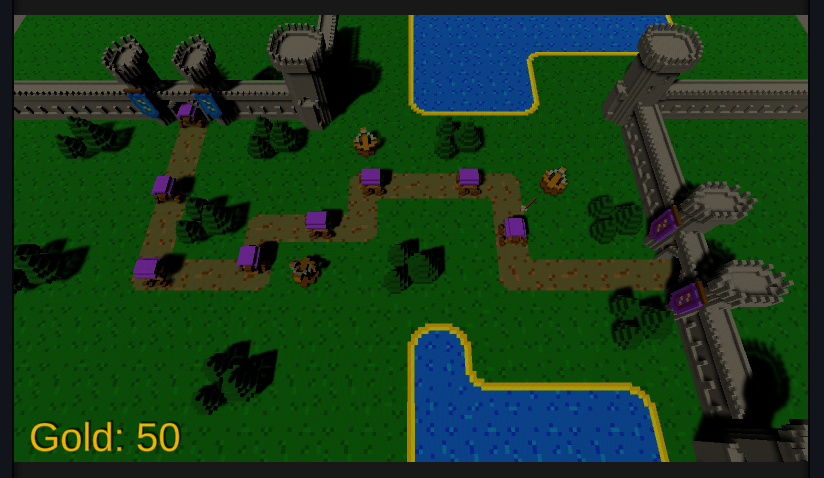

# Realm Rush - Unity Project
Tower defense style game where the enemy searches a way to the next castle fortess (using the Breadth-first search algorithm) and your job is to position defense towers using a gold-credit system with the purpose to eliminate the majority of enemies.

### Core Mechanic:
Using limited resources, strategically place towers to stop enemies from reaching their goal.

### Core game loop:
Survive against waves of enemies for as long as possible. Level reloads when the player runs out of gold.

